# CRUD_JSP-BBDDrev.2

Gestion de catequesis de Colmenarejo. 
Se requiere realizar la gestión de los niños y catequistas de los tres ciclos de preparación para recibir los sacramentos de iniciación cristiana en el núcleo de Colmenarejo (capilla Virgen de Fátima) que forma parte de la parroquia del Carmen de Campanillas. En esta revisión del anterior se incluye el uso de HashMap (implementado para establecer el login y la validación del mismo) y de ArrayList (empleado en la modificación del campo "ciclo" de las tres tablas que en la versión anterior se había definido como "enum").

## PÁGINA PRINCIPAL

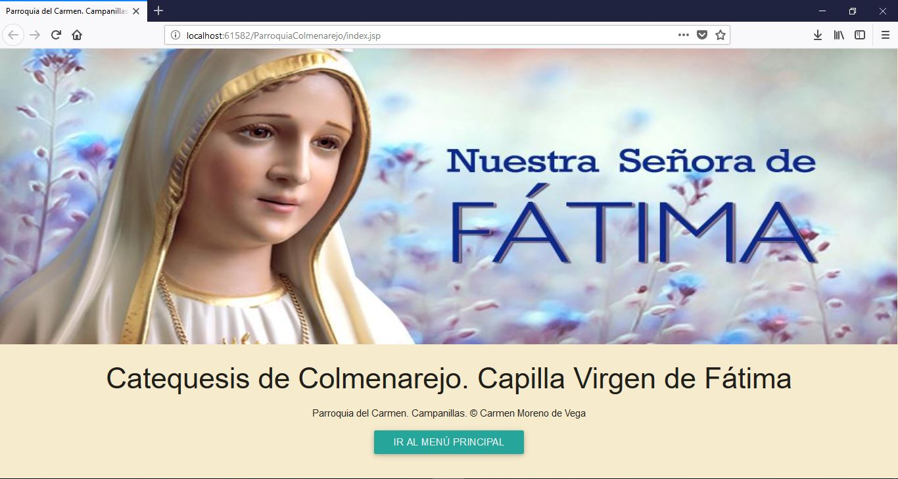

## MENÚ PRINCIPAL

En esta revisión del CRUD el menú principal ha sido modificado debido a que se incluye un login de acceso (generado mediante HashMap) y, en función de si es ADMIN o CATEQUISTA tienen accesos distintos. Solamente el ADMIN podrá acceder al área de gestión para realizar altas, bajas y modificaciones en la base de datos. Cualquier otro catequista una vez registrado accederá a los grupos de ciclos y podrá visualizar tanto catequistas como menores pero sin tener permiso de edición en base de datos.

## AREA DE GESTION DE MENORES Y CATEQUISTAS

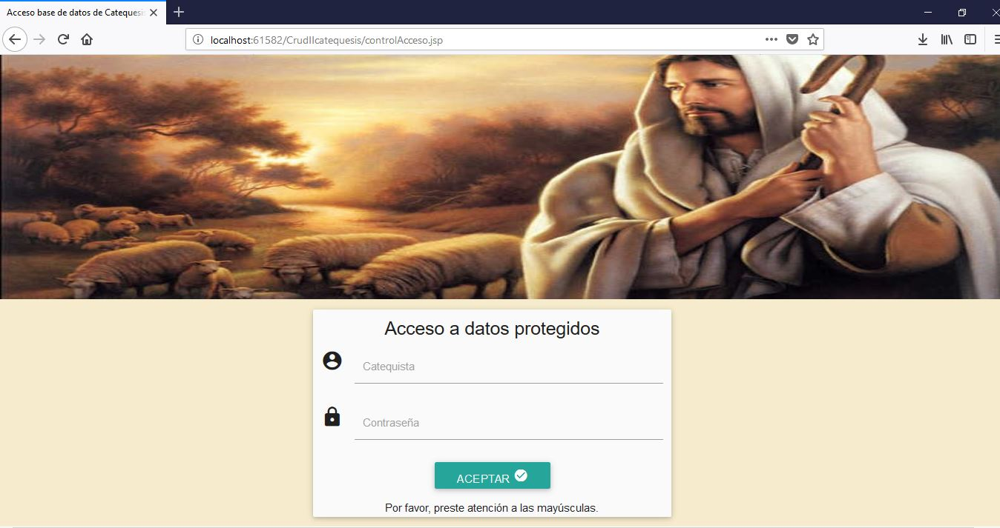
 
Si la contraseña del ADMIN es incorrecta, informa del error y envía de nuevo al usuario a la ventana de registro.

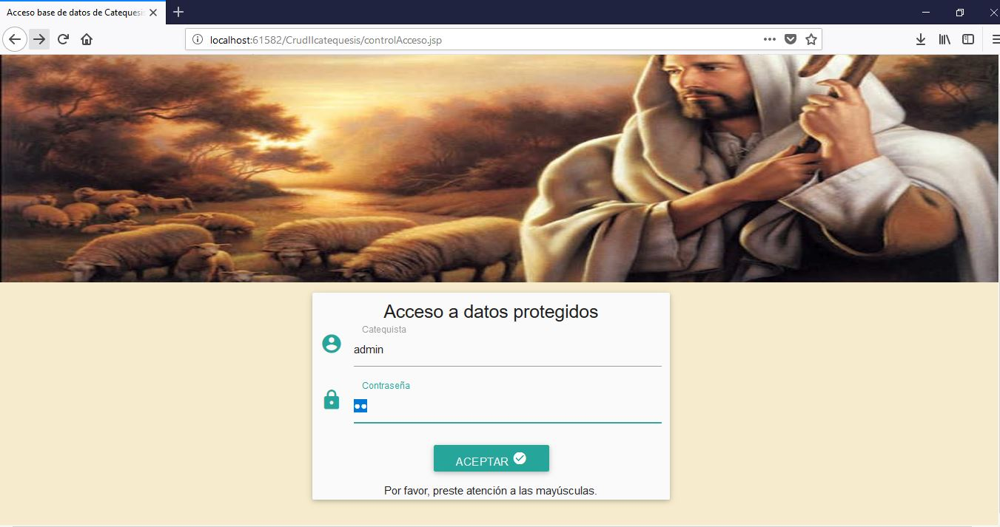

Si la contraseña es correcta, el Admin accede al área de gestión.

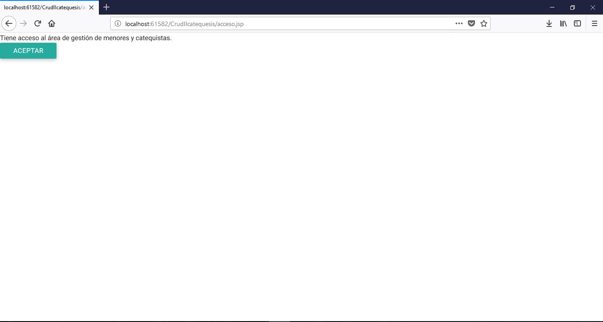
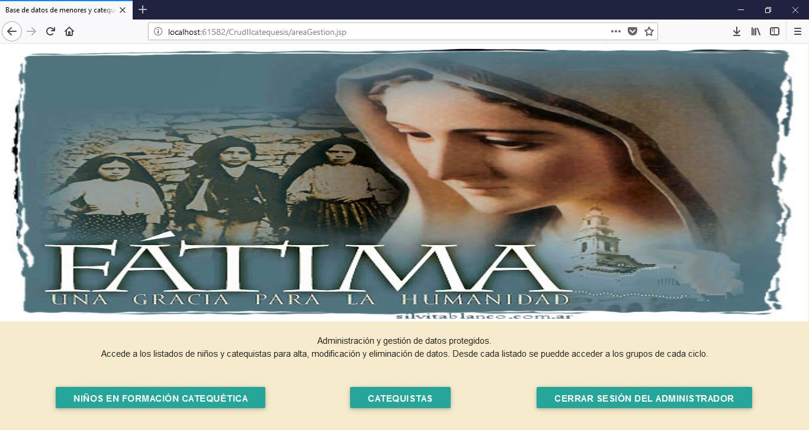

## CERRAR SESIÓN ADMIN

Si el admin sale de la sesión, retorna a la página principal.
Si, por el contrario decide continuar puede acceder a la gestion o ir a los ciclos.

## MENORES

 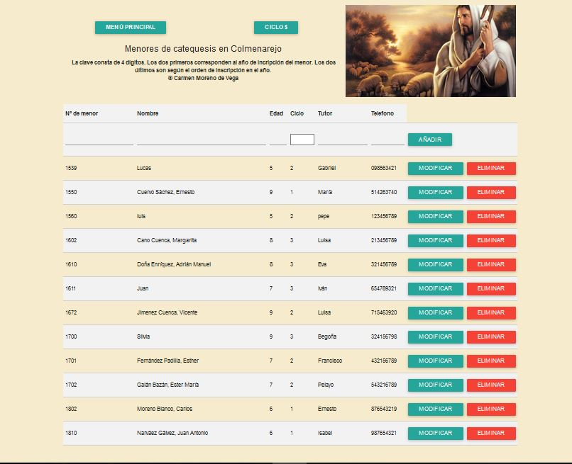
 
Modficar datos de los menores:

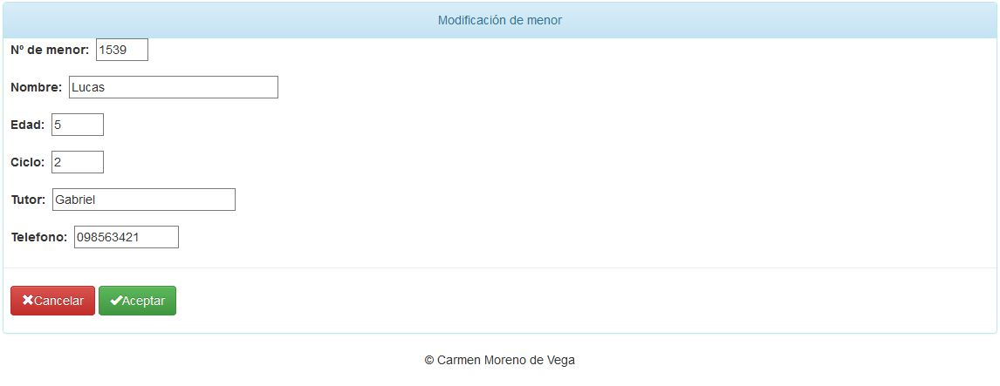

## CATEQUISTAS

 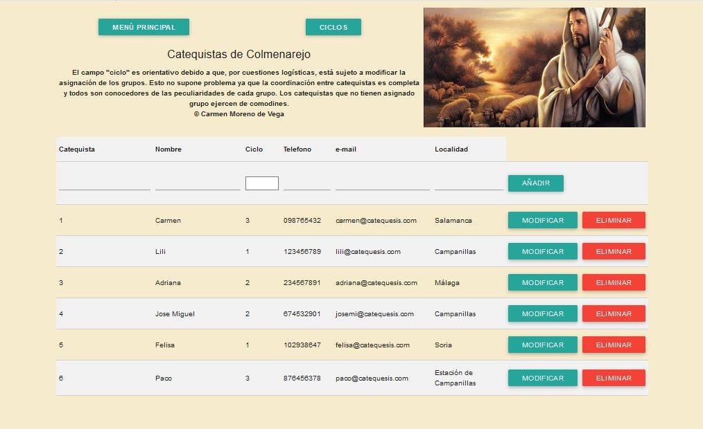

Modficar datos de los catequistas:

 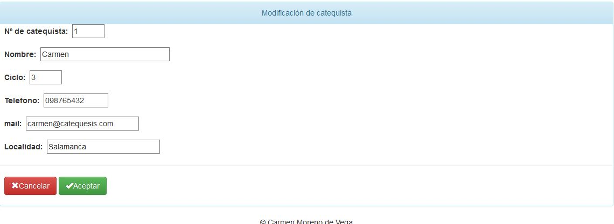

## CICLOS

 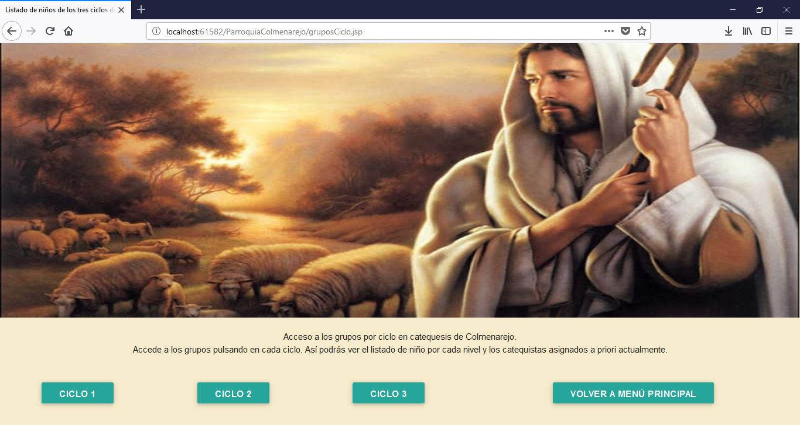
 
## CATEQUISTAS POR CICLO

 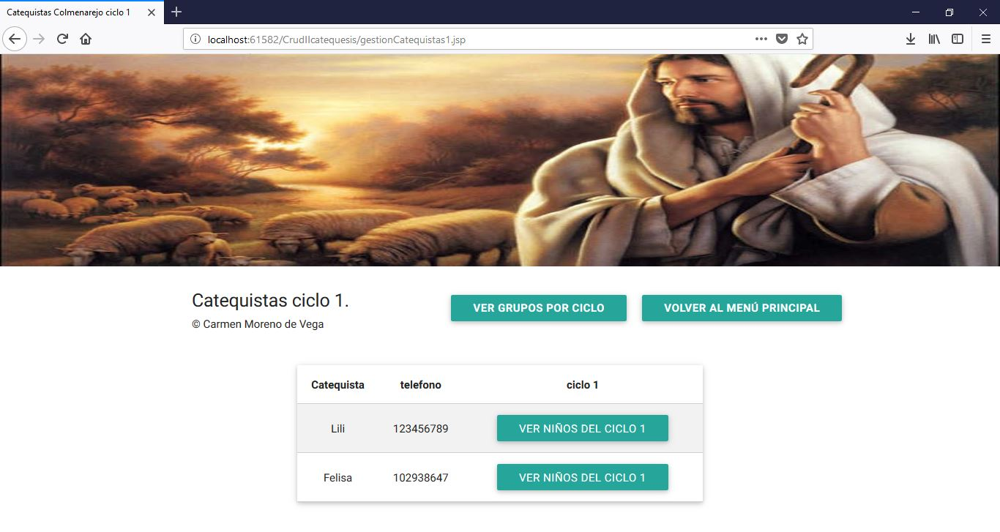

## MENORES POR CICLO

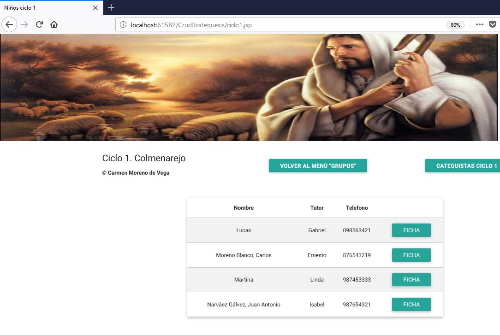

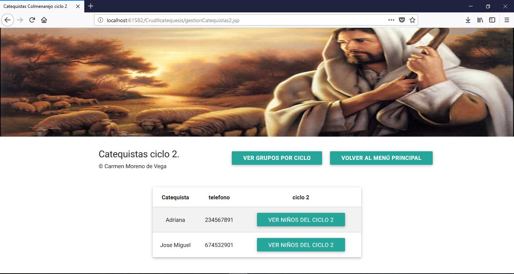

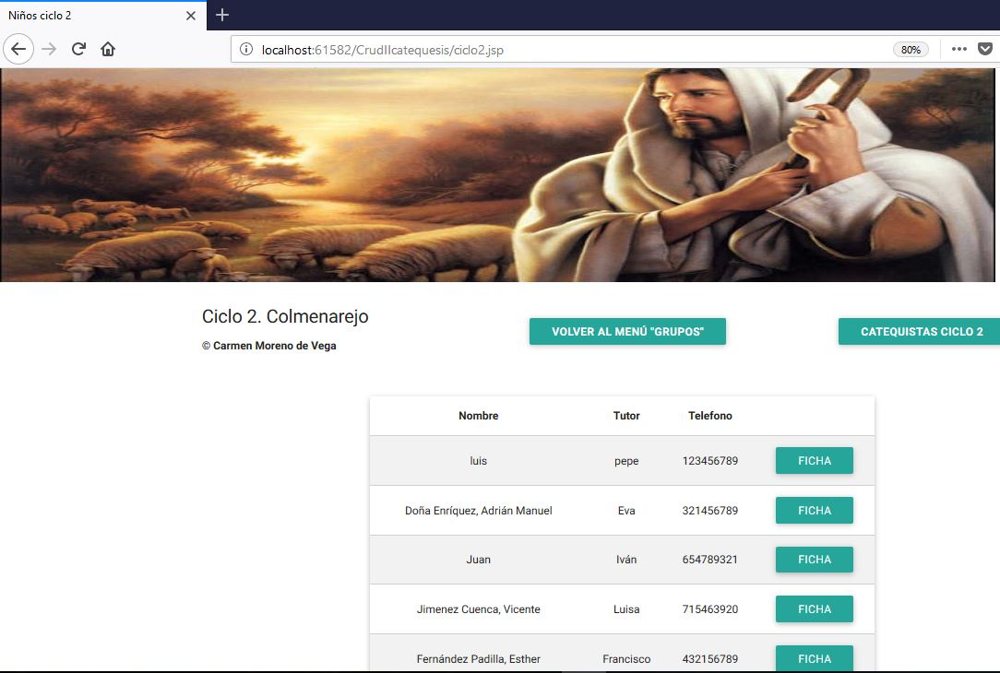

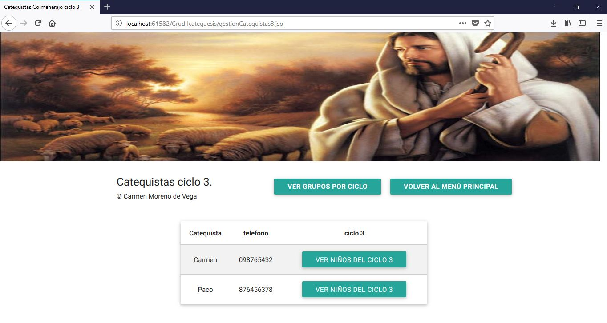
 

 
# REGISTRO DE CATEQUISTAS
Si cualquiera de los catequistas intentan logarse correctamente en el área de gestión serán remitidos al menú "CICLOS". Nunca podrán acceder a la zona de "ADMIN". Así, accederían al menú "CICLOS" descrito en los apartados anteriores.
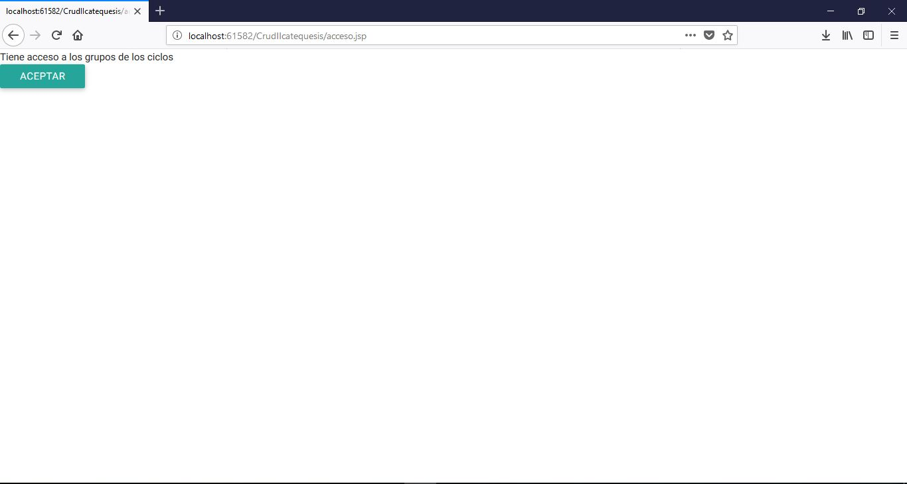

Si la contraseña no es correcta:

Si el usuario no existe:

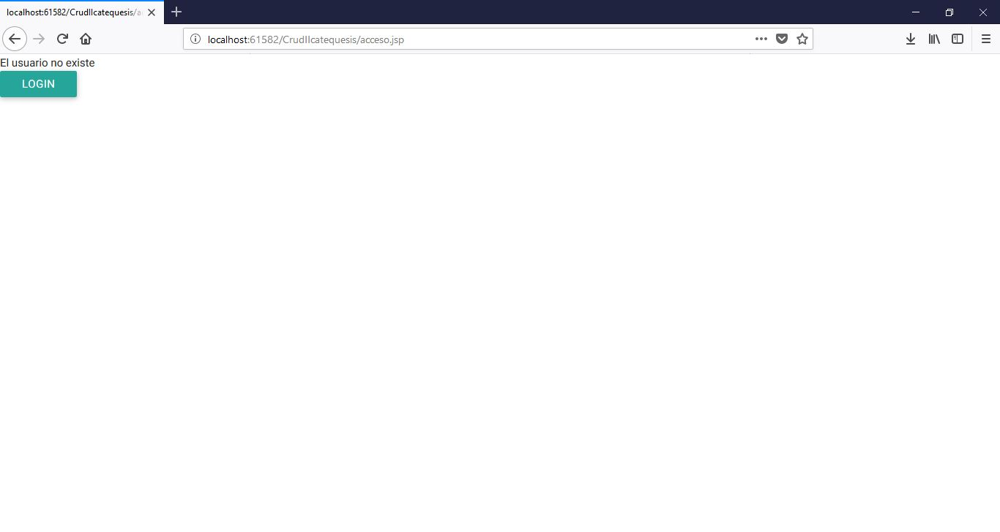

# BASE DE DATOS
A continuación, se incluye el diagrama entidad relacion de la base de datos creada para la realizacion de esta aplicacion crud:
   
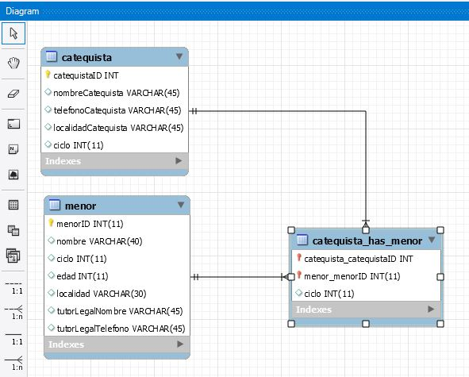
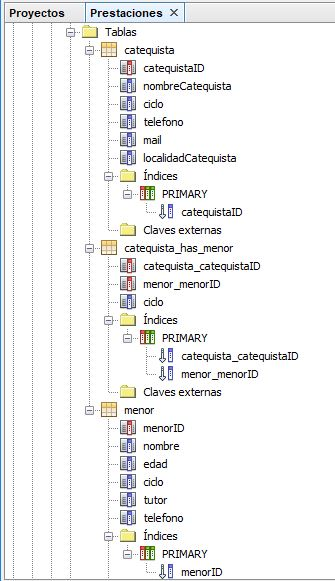
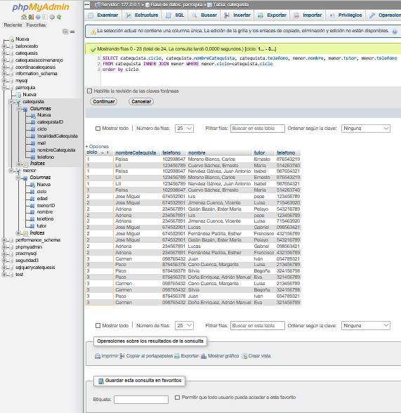
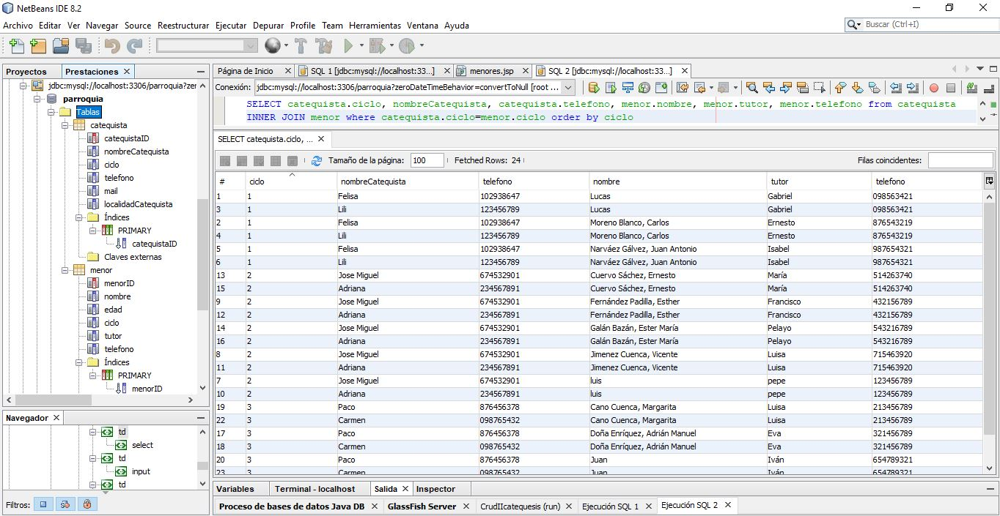

